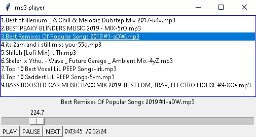

# mp3 player

This python program find all the mp3 files in the folder with the script, list all of them by name to a __Listbox__\
and show it to the user for later usage.

## Install Requirements
```
pip install -r requirements.txt
```
## Usage
```
Python mp3_player.py 
```


You can choose by clicking in the Listbox and clicking play, or by pressing the `NEXT` button.\
In any point, u can pause ur music and keep listening later.\
The numbers on the slider represent the seconds that have passed from the start, and below there\
is `H:M:S (hours:minute:seconds)`  format one from the start and one for the total time

`Note: need to fix some bugs and rearrange the code`

